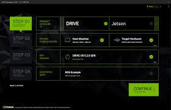

# Miru2

## About the Project

## Build of materials

* NVIDIA Jetson Orin Nano 8Gb [Developer kit]
* CS2230 M.2 NVMe SSD 500GB

* Logitech BRIO 4k Ultra HD Webcam

## How to setup Jetson Orin Nano 

### References

[1] [Nvidia Jetson Orin Nano Unboxing and SSD Flash Install With SDK Manager](https://youtu.be/FX2exKW_20E)

### Install SDK manager

To get started, ensure that you have a computer that is running Ubuntu 20.04. This is crucial because JetPack 5.1.3 has been tested to work optimally with Ubuntu 20.04, and this version also supports Python 3.8, which Miru2 is developed on. The Jetson Nano will be flashed with the main computer's Ubuntu version, making it essential to use Ubuntu 20.04. Next, [install the NVIDIA SDK Manager](https://developer.nvidia.com/sdk-manager) on your computer. This tool will be used to download and install the required JetPack version(s) onto the Jetson Orin Nano. To use the SDK Manager, you need to log in with your developer account. If you don't have one, [creating a developer account is straightforward.](https://developer.nvidia.com/login)

Mount NVMe

NVMe (Non-volatile memory) can be considered as a solid state memory unit which is the replacement rechnology for older hard-drives.
